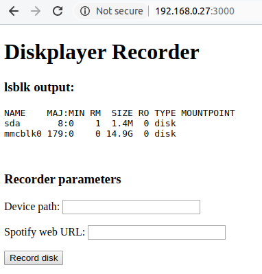
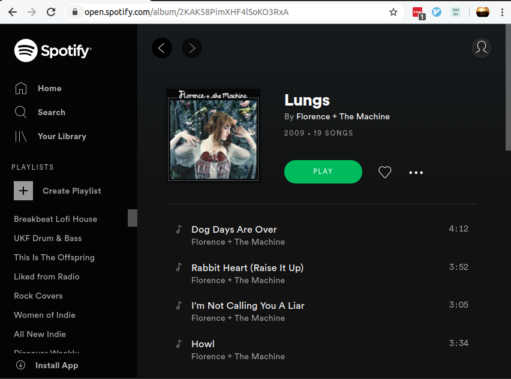
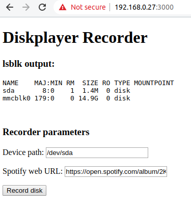
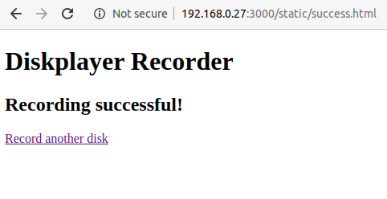

# diskplayer

diskplayer is essentially a Spotify client, written in Go, built around [zmb3's existing Spotify Web API wrapper
](https://github.com/zmb3/spotify).

This software is part of the larger "diskplayer" project of mine: a 3.5" floppy disk music player, running on a Raspberry Pi.

There are two components of diskplayer. The "player" binary and the "recorder" binary. The player binary can be used to obtain a new long-lived Spotify client authentication token, as well as accepting Spotify URI or a path to a file containing a Spotify URI which it will attempt to play. Playback occurs on an existing Spotify playback device, which is specified in a configuration file.
  
The recorder binary runs as an HTTP server, and exposes a simple UI which can be used to record a Spotify URI to a chosen location.

## Build

### Requirements

displayer was developed using Go 1.13 on Ubuntu 19.10, and uses go modules to install its required dependencies. Follow the instructions here to download and install the latest version of Go: https://golang.org/doc/install

### Player build

To build the player binary, run the following command from the terminal:

```shell script
$ go build -o player ./cmd/player/main.go
```
This will produce a `player` binary file in current directory. You will probably want to make this an executable binary file:

```shell script
$ chmod a+x player 
```

### Recorder build

To build the recorder binary, run the following command from the terminal:

```shell script
$ go build -o recorder ./cmd/recorder/main.go
```
This will produce a `recorder` binary file in current directory. You will probably want to make this an executable binary file:

```shell script
$ chmod a+x recorder 
```

## Tests

Tests can be run by issuing the following command from the project directory:

```shell script
$ go test
```

## Configuration

In this repository there exists a `diskplayer.yaml` configuration file which must be updated with the relevant config values.

diskplayer will search for the `diskplayer.yaml` configuration file in one of the following locations:

* `/etc/diskplayer/`
* `$HOME/.config/diskplayer/`
* or the current directory from which the `player` or `recorder` binary is being run.

For the Spotify-related config values see [the documentation for the zmb3's Spotify wrapper](https://github.com/zmb3/spotify#authentication). The callback URL must match that as configured when you set up your Spotify API application.

The `recorder.folder_path` configuration value represents to the folder to which the disk device will be mounted during the recording process. You will need to ensure that this folder exists.

## Player Usage

### Retrieving a new authentication token

Once the Spotify API application has been registered and the appropriate configuration values stored in the `diskplayer.yaml` file, the `player` binary can be run to create an authentication token which is stored and used for playback operations.

Before playback can be achieved a client OAuth2.0 access token must be retrieved. This must be run on a device where the user has access to a browser, as the user will be prompted to allow the `diskplayer` application permission to access and control the user's Spotify playback devices. This token is saved in json format to the file specified in the `diskplayer.yaml` configuration file, and can be copied across to a different device from which the `player` binary will be used (e.g. you can run the auth command from your laptop, and copy the json file across to a headless Raspberry Pi device).

To retreive a new authentication token, run the following command, and follow text that appears in the terminal.

```shell script
$ ./player -auth
```

### Play

Once a token file has been saved, you can begin playback operations. There are two methods of playing an album or playlist.

* by specifying a Spotify URI. E.g. :

```shell script
$ ./player -uri spotify:album:3oyu7chRauu88JYPYfFB55
```

* or by specifying a path to a file which contains a single Spotify URI:

```shell script
$ ./player -path /tmp/diskplayer.contents
```

### Pause

Playback can be paused on the diskplayer device by running the following command:

```shell script
$ ./player -pause
```

## Recorder Usage

The recorder binary runs an HTTP server which offers a simple HTML form which can be used to translate a record a Spotify URI to the location as specified in the `diskplayer.yaml` configuration file.

Run the server by executing the following command:

```shell script
$ ./recorder
```

This will run an HTTP server on the port specfied in the `diskplayer.yaml` configuration file. If you visit `http://<IP address of device>:<diskplayer recorder port>/` you should see the following page:



The section titled `lsblk output:` does exactly that - it lists the devices that can found on the machine running the recorder server. The intention is to provide to the user an indication of where a disk drive can be found. From the above screenshot the user can assume that the disk drive device can be found at `/dev/sda`. If you don't see any `sdx` device listed you may need to insert a disk and refresh the page.

To record a Spotify URI you will need a device path (i.e. `/dev/sda`) and a Spotify web URL (*note that this is not a Spotify URI*). I've done this as it is easy to copy a web URL from one tab into the Recorder tab.

To obtain a Spotify URL for an album or playlist, open `https://play.spotify.com` in your browser and locate an album that you wish to record:



Copy the full URL for this page, and enter into the diskplayer record page, along with the path to the device to which the disk drive is attached:



Cick the "Record disk" button, and you should see a success page telling you that the recording was successful:



This disk can now be played :)

